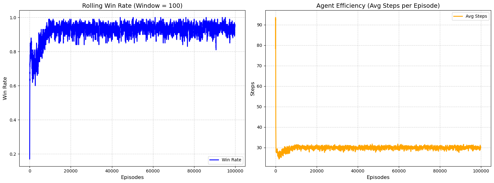

# Tabular Q gridworld

## Overview
Agent: Bellman equation for q update + greedy-epsilon for choice

Environment: 15x15 gridworld, with 13 hazards that instantly kill Agent and ends run. Single Objective on opposite side of gridworld

### Goal

Goal is to create gridworld. Test how Q-tabular and DQN work and investigate how Q-Tabular behaves. The plan after this project is to go onto BrainPy and a new environment

My goals for this environment and agent changed nearing the end of my successful Q-tabular agent implementation. 

---

## Agent

### Q-Tabular + Greedy - Epsiolon

State was represented as integers. For the 15x15 environment my agent had a tab of shape (245, 4). Every action had 4 choices: up, down, left, right

Simple implementation. 

I learned how to use the conditionals and jnp specific functions

## Environment

### Gridworld

Gridworld accepts policy and current state from agent. 

Gridworld first converts state integer into (x,y) coordinate. 

Agent gave 3 rewards. +100 for reaching goal, -100 for hazard, -1 for step. 

jnp.clip to detect out of bounds, if agent moved out of bounds, env would return state, unchanged and -1 reward for step

--- 

## Conclusion

### Performance

Metrics tracked were steps per run, rolling win rate, and simulation time. 

Execution time was as low as 5.7268712520599365 seconds over 100,000 runs. 

Graphs for average steps and rolling win rate were beautiful:

### Difficulties 

Most difficulty with figuring out loops. Used jax.lax.while_loop for single episode then used jax.lax.scan to simulate multiple runs

Figuring out carry was difficult, scan scans over xs, which is an array of keys. 

Deciding state representation for environment was also difficult, but first decision choice

### What now? 

Moving to DQN. Will use same env for DQN and compare performance betweeen DQN and Q-Tabular

